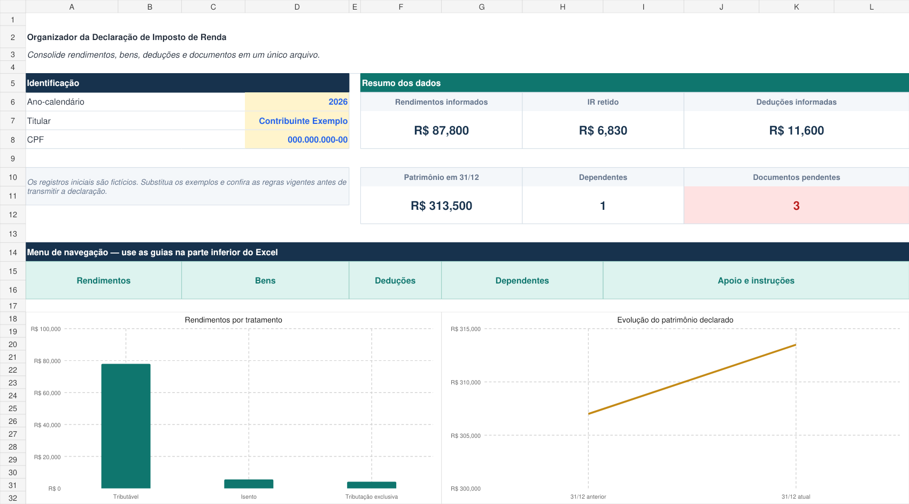
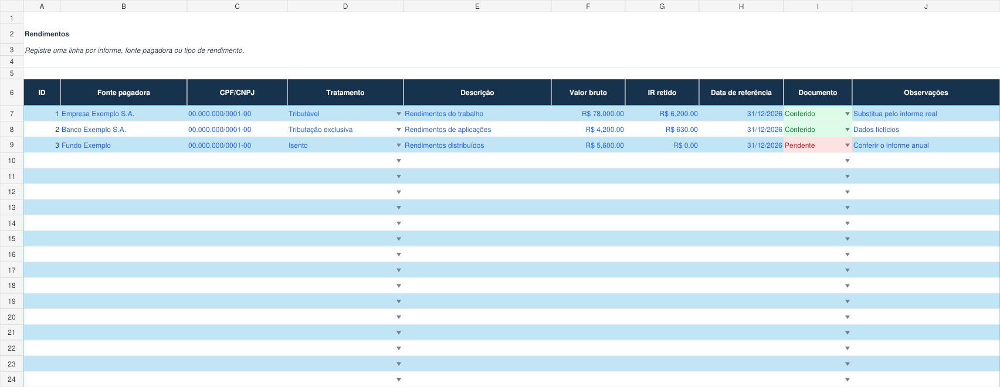

# Organizador de Declaração de Imposto de Renda em Excel

Projeto desenvolvido para o desafio da DIO com o objetivo de reunir, validar e acompanhar as principais informações usadas na preparação da declaração de imposto de renda.

A solução foi construída inteiramente no Excel. O arquivo separa os dados por natureza, consolida os totais em um dashboard e destaca documentos que ainda precisam de conferência.

[Baixar a planilha](./Organizador_Imposto_Renda.xlsx)

## Visão geral



O dashboard apresenta:

- rendimentos informados;
- imposto de renda retido;
- valores informados como dedutíveis;
- patrimônio declarado em 31/12;
- quantidade de dependentes;
- documentos ainda pendentes;
- comparação dos rendimentos por tratamento tributário;
- evolução do patrimônio entre os dois períodos.

## Funcionalidades

- Cadastro de rendimentos tributáveis, isentos e sujeitos à tributação exclusiva.
- Controle de bens e direitos com comparação entre os saldos de 31/12.
- Registro de pagamentos e valores informados como dedutíveis.
- Cadastro de dependentes, rendimentos próprios e despesas.
- Listas de seleção para reduzir erros de preenchimento.
- Destaque automático para documentos conferidos ou pendentes.
- Tabelas estruturadas com filtros e cem linhas preparadas em cada cadastro.
- Dashboard atualizado por fórmulas a partir dos registros.
- Guia de apoio com fluxo de preenchimento e revisão.

## Estrutura da planilha

| Guia | Finalidade |
| --- | --- |
| Dashboard | Identificação do titular, indicadores, alertas e gráficos. |
| Rendimentos | Informes, fontes pagadoras, tratamento tributário e IR retido. |
| Bens | Bens e direitos, saldos de 31/12 e variação calculada. |
| Deducoes | Pagamentos, categorias e valor informado como dedutível. |
| Dependentes | Identificação, rendimentos, despesas e documentos. |
| Apoio | Etapas de revisão, listas de referência e orientações de uso. |

## Como usar

1. Abra a guia **Dashboard** e substitua o ano-calendário, o nome e o CPF fictícios.
2. Nas guias de cadastro, apague os exemplos e informe os dados reais.
3. Use as listas suspensas para classificar cada registro.
4. Marque os comprovantes como **Conferido** ou **Pendente**.
5. Volte ao dashboard e revise os totais e os documentos pendentes.
6. Compare os valores com os informes e comprovantes antes de usar os dados na declaração.



## Implementação

A planilha utiliza recursos nativos e editáveis do Excel:

- tabelas formatadas com filtros;
- validação de dados;
- formatação condicional;
- fórmulas `SUM`, `SUMIFS`, `COUNTIFS` e `COUNTA`;
- cálculo de variação por registro;
- gráficos vinculados às células de resumo;
- painéis congelados nos cadastros para facilitar a navegação.

Os cálculos usam intervalos delimitados, o que deixa a lógica simples de conferir e evita referências desnecessárias a colunas inteiras.

## Dados de exemplo

Os registros incluídos no arquivo são fictícios e servem apenas para demonstrar o funcionamento do dashboard. Eles devem ser substituídos antes do uso.

O organizador não calcula o imposto devido e não aplica automaticamente limites legais. As regras podem mudar conforme o ano-calendário, por isso os valores devem ser conferidos no programa e nas orientações oficiais.

## Estrutura do repositório

```text
.
├── images/
│   ├── dashboard.png
│   └── rendimentos.png
├── .gitignore
├── Organizador_Imposto_Renda.xlsx
└── README.md
```

## Objetivos atendidos

- aplicação prática dos conceitos de Excel;
- organização de dados em tabelas estruturadas;
- validação e acompanhamento de pendências;
- documentação técnica clara;
- publicação do projeto em um repositório público no GitHub.
